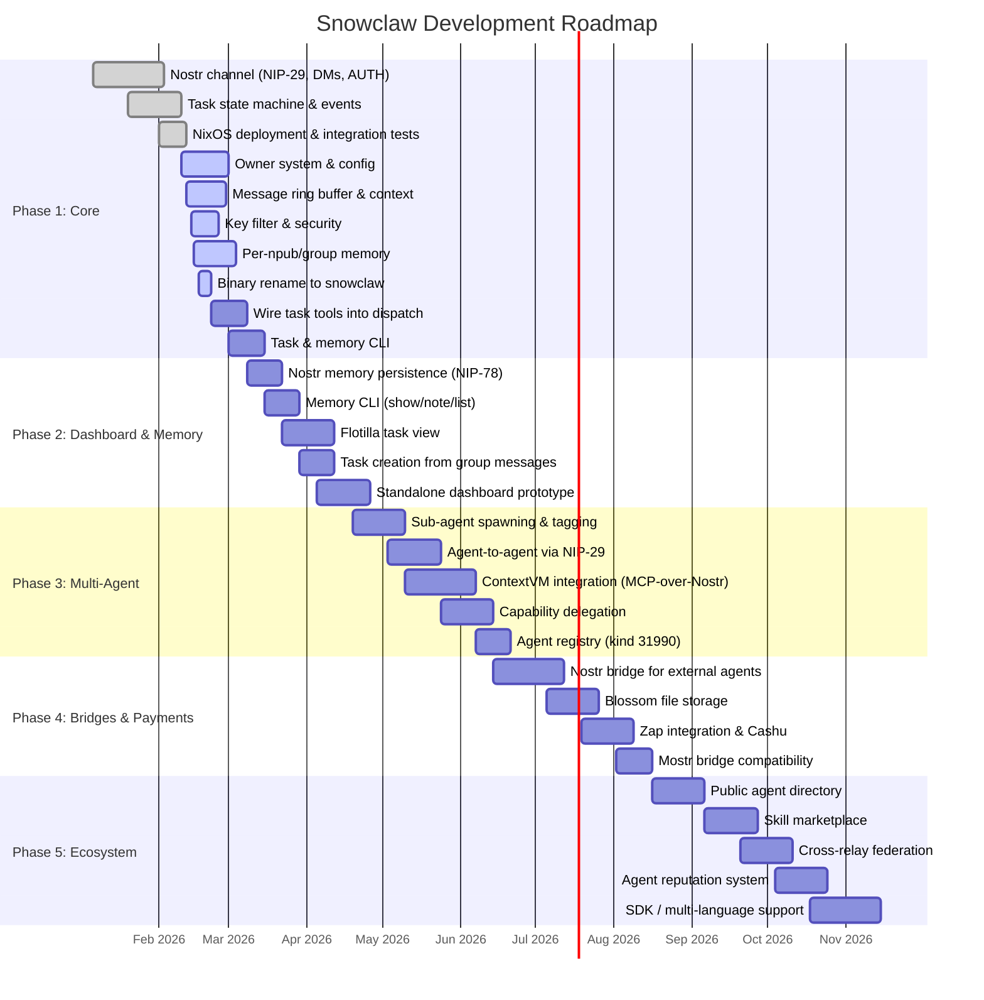

# Snowclaw Roadmap

> **Last updated:** 2026-02-18  
> **Version:** 1.0  
> **Authors:** k0, Clarity

Snowclaw is a Nostr-native agent framework built in Rust. Agents are first-class Nostr citizens with their own keypairs, communicating via signed events over relays. No proprietary APIs, no platform lock-in.

This document tracks the project from its current state through ecosystem maturity across 5 phases.

---

## Status Legend

| Icon | Meaning |
|------|---------|
| ✅ | Done |
| 🔧 | In progress |
| 📋 | Planned |
| ⚠️ | At risk |

---

## Timeline Overview



---

## Phase 1: Core Agent Infrastructure

**Timeline:** Weeks 1–10 (Jan 6 – Mar 15, 2026)  
**Status:** 🔧 ~75% complete  
**MVP marker:** Agent can receive messages in Nostr groups, respond via LLM, and manage tasks

### Deliverables

| # | Deliverable | Status | Notes |
|---|-------------|--------|-------|
| 1.1 | Nostr channel (NIP-29 groups, NIP-17 DMs, NIP-42 AUTH) | ✅ | `src/channels/nostr.rs` — E2E working |
| 1.2 | Profile cache & LRU event cache | ✅ | Compact headers, dedup |
| 1.3 | Task state machine (8 states, validated transitions) | ✅ | `src/tasks/state.rs` — Draft→Queued→Executing→Blocked→Review→Done/Failed/Cancelled |
| 1.4 | Task events (kind 1621, 1630-1637, 31923) | ✅ | `src/tasks/events.rs` |
| 1.5 | Nostr memory backend (NIP-78 kind 30078) | ✅ | `src/memory/nostr.rs` — compiled, not yet wired as default |
| 1.6 | Nostr CLI (keygen, whoami, import, relays) | ✅ | `src/nostr_cli.rs` |
| 1.7 | NixOS service deployed (port 3200) | ✅ | `snowclaw.service` on zooid |
| 1.8 | Integration tests with nak serve | ✅ | Zero compiler warnings |
| 1.9 | Justfile (build/deploy/test/status/logs) | ✅ | |
| 1.10 | Channel routing fix (sub-addressing) | ✅ | |
| 1.11 | Owner system (owner pubkey, 4-mode respond) | 🔧 | none/owner/mention/all |
| 1.12 | Dynamic config via NIP-78 from owner | 🔧 | |
| 1.13 | Message ring buffer with context history | 🔧 | |
| 1.14 | Secret key security filter (nsec redaction) | 🔧 | `src/security/key_filter.rs` |
| 1.15 | Per-npub and per-group memory | 🔧 | Auto-created on first interaction |
| 1.16 | Binary rename zeroclaw → snowclaw | 🔧 | |
| 1.17 | Wire task tools into agent dispatch | 📋 | Connect `src/tools/nostr_tasks.rs` to tool system |
| 1.18 | Task CLI (`snowclaw task create/list/status/update`) | 📋 | `src/task_cli.rs` exists |
| 1.19 | Wire Nostr memory as selectable backend | 📋 | `memory.backend = "nostr"` config |
| 1.20 | Sub-agent tagging on events | 📋 | `["agent", "name"]` tag |

### Dependencies
- None (foundational phase)

### Risks & Mitigations

| Risk | Impact | Mitigation |
|------|--------|------------|
| NIP-29 relay instability (zooid) | High | Reconnect with exponential backoff; fallback to Telegram channel |
| Task event schema changes | Medium | Version tag on events; migration tool |
| Binary rename breakage | Low | Feature-flagged; update NixOS service config atomically |

---

## Phase 2: Dashboard & Memory Persistence

**Timeline:** Weeks 9–16 (Mar 8 – Apr 26, 2026)  
**Status:** 📋 Planned  
**MVP marker:** Tasks visible in browser UI; memory persists across restarts via relay

### Deliverables

| # | Deliverable | Status | Notes |
|---|-------------|--------|-------|
| 2.1 | NIP-78 memory persistence to relay | 📋 | Currently in-memory only; wire `src/memory/nostr.rs` as default |
| 2.2 | Memory CLI (`snowclaw nostr memory show/note/list`) | 📋 | |
| 2.3 | Flotilla task view (kind 1621 + 31923 subscription) | 📋 | Read-only browser view of tasks |
| 2.4 | Task creation from group messages | 📋 | Owner says "create task: ..." → kind 1621 |
| 2.5 | Task numbering (SNOW-1, SNOW-2) | 📋 | Linear-style prefix |
| 2.6 | Task filtering/views (status, assignee, priority) | 📋 | |
| 2.7 | Live run state in dashboard (kind 31923 progress bars) | 📋 | |
| 2.8 | Standalone dashboard prototype | 📋 | Pure client, no server backend |
| 2.9 | Task status updates from agent during execution | 📋 | |

### Dependencies
- **Phase 1 complete** — task tools wired, memory backend selectable
- Flotilla codebase access for task view integration

### Risks & Mitigations

| Risk | Impact | Mitigation |
|------|--------|------------|
| Flotilla upstream changes | Medium | Fork if needed; standalone dashboard as fallback |
| NIP-78 event size limits | Low | Chunk large memory entries; use Blossom for big data (Phase 4) |
| Dashboard auth complexity | Medium | Start read-only; add NIP-46 signer later |

---

## Phase 3: Multi-Agent & ContextVM

**Timeline:** Weeks 15–24 (Apr 19 – Jun 21, 2026)  
**Status:** 📋 Planned  
**MVP marker:** Two agents can discover each other's capabilities and delegate tasks

### Deliverables

| # | Deliverable | Status | Notes |
|---|-------------|--------|-------|
| 3.1 | Sub-agent spawning with parent npub + agent tag | 📋 | Persistent npubs, not ephemeral |
| 3.2 | Agent-to-agent communication via NIP-29 groups | 📋 | Shared project groups |
| 3.3 | ContextVM integration (MCP-over-Nostr) | 📋 | Tool discovery & invocation by npub |
| 3.4 | Capability delegation (owner grants tools) | 📋 | |
| 3.5 | Parallel task execution with status tracking | 📋 | |
| 3.6 | Agent registry (kind 31990 or similar) | 📋 | Publish capabilities manifest |
| 3.7 | Review workflow via NIP-22 comments | 📋 | APPROVE/CONTINUE/SPAWN/DISCARD/MERGE |

### Dependencies
- **Phase 2** — dashboard for monitoring multi-agent activity
- **Phase 1** — task system fully wired
- ContextVM spec stability (external dependency)

### Risks & Mitigations

| Risk | Impact | Mitigation |
|------|--------|------------|
| ContextVM spec immaturity | High | Design with optional dependency; system works without it |
| Agent identity management complexity | Medium | Start with manual npub provisioning; automate later |
| Nostr relay message ordering | Medium | Timestamp-based ordering; NIP-29 group ordering guarantees |

---

## Phase 4: Bridges, Blossom & Payments

**Timeline:** Weeks 23–32 (Jun 14 – Aug 16, 2026)  
**Status:** 📋 Planned  
**MVP marker:** Non-Nostr agent (OpenClaw) participates in Nostr group via bridge; files stored on Blossom

### Deliverables

| # | Deliverable | Status | Notes |
|---|-------------|--------|-------|
| 4.1 | **Nostr Bridge for external agents** | 📋 | Key Phase 4 deliverable (see below) |
| 4.2 | Blossom file storage (images, documents, artifacts) | 📋 | Binary data companion to text events |
| 4.3 | Zap integration (Lightning payments for task bounties) | 📋 | NWC for programmatic zaps |
| 4.4 | Cashu token support | 📋 | Ecash for micro-payments between agents |
| 4.5 | Mostr bridge compatibility (ActivityPub) | 📋 | Interop with Mastodon ecosystem |
| 4.6 | NIP-46 remote signing | 📋 | Human-in-the-loop for sensitive ops |
| 4.7 | Memory encryption (NIP-44) | 📋 | Private memory entries |

### 4.1 Nostr Bridge — Deep Dive

The Nostr Bridge enables non-Nostr agents (OpenClaw, Clarity, or any webhook-capable framework) to participate in Nostr NIP-29 groups as if they were native participants.

**Architecture:**

```
┌──────────────┐     webhook POST      ┌──────────────────┐     NIP-29 events     ┌─────────────┐
│  OpenClaw    │◄─────────────────────►│   Nostr Bridge   │◄────────────────────►│ Nostr Relay │
│  (Clarity)   │  JSON: {group, text}  │  (Rust service)  │  kind 9/11/12        │  (zooid)    │
│              │                        │                  │                       │             │
│  Webhook     │  ←── new messages     │  • WebSocket sub │  ←── group messages  │  NIP-29     │
│  endpoint    │      from groups      │  • Webhook push  │      from relay      │  NIP-42     │
└──────────────┘                        │  • Identity map  │                       └─────────────┘
                                        │  • npub per agent│
                                        └──────────────────┘
```

**Key features:**
- **WebSocket relay → webhook translation**: Subscribes to NIP-29 groups, pushes new messages to agent framework webhooks as JSON
- **Identity mapping**: Each external agent gets an npub; bridge signs events on their behalf
- **Bidirectional**: Agent sends JSON POST → bridge publishes as NIP-29 event; relay events → webhook to agent
- **Group scoping**: Bridge is configured per-group, so agents only see relevant conversations
- **Auth handling**: Bridge manages NIP-42 AUTH transparently

**Existing foundation:** `~/work/nostronautti/bridge/` — current bridge service (`nostr-bridge.service`) already handles relay→webhook for the inner-circle group. Phase 4 generalizes this into a multi-agent, multi-group, bidirectional bridge.

### Dependencies
- **Phase 3** — agent registry for capability advertisement
- **Phase 1** — Nostr channel for bridge relay connectivity
- Lightning/NWC infrastructure for zaps
- Blossom server deployment

### Risks & Mitigations

| Risk | Impact | Mitigation |
|------|--------|------------|
| Bridge identity trust (who controls npubs?) | High | Owner-approved bridge registration; signed delegation |
| Lightning integration complexity | Medium | Start with manual zaps; automate via NWC |
| Blossom server availability | Low | Self-host on zooid; CDN fallback |
| Bridge message latency | Medium | WebSocket keep-alive; relay proximity |

---

## Phase 5: Ecosystem & Federation

**Timeline:** Weeks 32–45 (Aug 16 – Nov 15, 2026)  
**Status:** 📋 Planned  
**MVP marker:** Public agent directory where anyone can discover and interact with Snowclaw agents

### Deliverables

| # | Deliverable | Status | Notes |
|---|-------------|--------|-------|
| 5.1 | Public agent directory on Nostr | 📋 | Browse agents by capability, relay, reputation |
| 5.2 | Skill marketplace (agents publish capabilities) | 📋 | ContextVM manifests as listings |
| 5.3 | Cross-relay federation | 📋 | Agents span multiple relays |
| 5.4 | Agent reputation system | 📋 | Based on task completion rate, zaps received |
| 5.5 | Template system for common agent patterns | 📋 | `snowclaw init --template chatbot` |
| 5.6 | SDK/library for other languages | 📋 | Python, TypeScript bindings |

### Dependencies
- **Phase 4** — bridges and payments for full ecosystem interop
- **Phase 3** — agent registry and ContextVM for discoverability
- Community adoption and feedback

### Risks & Mitigations

| Risk | Impact | Mitigation |
|------|--------|------------|
| Low adoption | High | Dogfood with own agents first; publish useful templates |
| Reputation gaming | Medium | Weight reputation by stake (zaps) and task verifiability |
| Cross-relay consistency | Medium | Eventual consistency model; don't require strong consensus |
| SDK maintenance burden | Medium | Start with one language (TypeScript); community-driven |

---

## Dependency Graph

```
Phase 1 (Core)
    │
    ├──► Phase 2 (Dashboard + Memory)
    │        │
    │        ├──► Phase 3 (Multi-Agent + ContextVM)
    │        │        │
    │        │        ├──► Phase 4 (Bridges + Payments)
    │        │        │        │
    │        │        │        └──► Phase 5 (Ecosystem)
    │        │        │
    │        │        └──► Phase 4.1 (Nostr Bridge) ← partial Phase 1 dependency
    │        │
    │        └──► Phase 4.2 (Blossom) ← can start with Phase 2 memory work
    │
    └──► Phase 4.1 (Nostr Bridge) ← can prototype early with existing bridge code
```

**Critical path:** Phase 1 → Phase 2 → Phase 3 → Phase 4 → Phase 5

**Parallelizable:**
- Nostr Bridge (4.1) prototype can start any time (existing code in nostronautti/bridge)
- Blossom (4.2) can start alongside Phase 2 memory work
- Dashboard (2.3-2.8) can develop in parallel with memory persistence (2.1-2.2)

---

## Source Code Map (current)

| Module | Path | Files | Status |
|--------|------|-------|--------|
| Channels | `src/channels/` | 18 files (nostr.rs, telegram.rs, discord.rs, etc.) | ✅ Core working |
| Tasks | `src/tasks/` | 3 files (state.rs, events.rs, mod.rs) | ✅ Compiled |
| Memory | `src/memory/` | 12 files (nostr.rs, postgres.rs, sqlite.rs, markdown.rs, etc.) | ✅ Multiple backends |
| Tools | `src/tools/` | 28 files (nostr_tasks.rs, shell.rs, browser.rs, etc.) | ✅ Rich toolset |
| Security | `src/security/` | 12 files (key_filter.rs, landlock.rs, bubblewrap.rs, etc.) | ✅ Sandboxing ready |
| Agent | `src/agent/` | 7 files (agent.rs, loop_.rs, dispatcher.rs, classifier.rs, etc.) | ✅ Core loop |
| Providers | `src/providers/` | 12 files (anthropic.rs, openai.rs, openrouter.rs, etc.) | ✅ Multi-provider |
| Observability | `src/observability/` | 8 files (otel.rs, prometheus.rs, etc.) | ✅ Telemetry |
| Peripherals | `src/peripherals/` | 10 files (arduino, rpi, serial, etc.) | ✅ Hardware |
| Cron | `src/cron/` | 5 files (scheduler.rs, store.rs, etc.) | ✅ Scheduling |

**Total:** ~170 Rust source files across 20+ modules

---

## Key Metrics & Milestones

| Milestone | Target Date | Phase | Criteria |
|-----------|-------------|-------|----------|
| **Agent responds in Nostr group** | ✅ Feb 2026 | 1 | E2E: message → LLM → reply via NIP-29 |
| **Owner controls agent** | Mar 2026 | 1 | Dynamic config, respond modes, nsec security |
| **Tasks visible in browser** | Apr 2026 | 2 | Flotilla or standalone shows kind 1621 list |
| **Memory survives restart** | Mar 2026 | 2 | NIP-78 backed, verifiable on relay |
| **Two agents collaborate** | Jun 2026 | 3 | Agent A delegates subtask to Agent B |
| **OpenClaw in Nostr group** | Jul 2026 | 4 | Bridge translates webhook ↔ NIP-29 |
| **Public agent directory** | Sep 2026 | 5 | Anyone can browse and interact with agents |

---

## Design Principles

1. **Nostr is the bus** — all communication, tasks, logs, and memory are signed events
2. **Every agent has an npub** — identity, attribution, accountability are native
3. **NIP-first** — use existing NIPs; extend only where necessary
4. **Offline-capable** — agents work locally, sync to relay when available
5. **Text-first** — core data is text/JSON; binary via Blossom
6. **Human-in-the-loop** — owner system for oversight; NIP-46 for sensitive signing

---

## Nostr Event Kinds Used

| Kind | Type | Purpose | Phase |
|------|------|---------|-------|
| 9, 11, 12 | Regular | NIP-29 group messages | 1 ✅ |
| 1059 | Regular | NIP-17 gift-wrapped DMs | 1 ✅ |
| 1621 | Addr/Repl | Tasks (NIP-34 extended) | 1 ✅ |
| 1630-1633 | Regular | Status: Queued/Done/Cancelled/Draft | 1 ✅ |
| 1634-1637 | Regular | Status: Executing/Blocked/Review/Failed | 1 ✅ |
| 30078 | Addr/Repl | Memory KV store (NIP-78) | 1 ✅ |
| 31923 | Addr/Repl | Task run state (live progress) | 1 ✅ |
| 31617 | Addr/Repl | Project definition | 2 📋 |
| 31990 | Addr/Repl | Agent registry / capabilities | 3 📋 |

---

*This is a living document. Updated as phases complete and priorities shift.*
