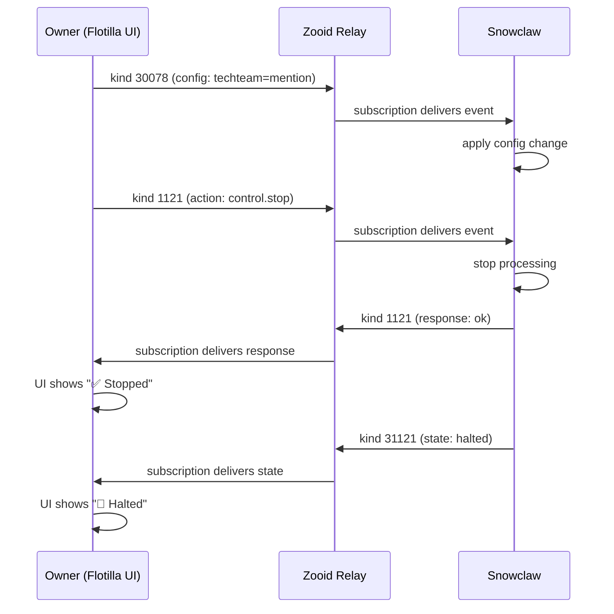

# Flotilla UI Extensions for Snowclaw v0.1

## Overview

Flotilla is the web client for Nostr groups. These specs define UI additions for agent-aware features: meta events in conversation flow, task views, and agent/channel configuration.

All data comes from Nostr relay subscriptions — no custom APIs. The UI subscribes to event kinds and renders them.

## 1. Agent Meta Events in Conversation Flow

### Event Types to Render

Regular group messages (kind 9) show as normal chat. Agent-specific events get special rendering:

| Kind | UI Treatment | Visual |
|------|-------------|--------|
| 9 (from agent npub) | Chat bubble with agent badge | 🤖 icon + agent name |
| 1121 (action request) | Inline command card | `→ config.set respond_mode=mention` |
| 1121 (action response) | Inline result card | `✅ config updated` or `⛔ denied` |
| 1621 (task created) | Task card embed | Title, priority, assignee |
| 1630-1637 (task status) | Status badge inline | `📋 Task CRO-18: In Progress → Done` |
| 31121 (agent state) | System message | `🤖 Snowclaw is online` |
| 31923 (task run state) | Live progress indicator | `⏳ Executing: 45% — indexing files...` |
| 30078 (config event) | Config change notification | `⚙️ Owner set #techteam to mention mode` |

### Rendering Rules

1. **Agent detection**: maintain a set of known agent npubs (from kind 31121 events or manual config). Messages from agent npubs get the 🤖 badge.

2. **Action events (1121)**: render as compact cards, not chat bubbles:
   ```
   ┌─────────────────────────────────────┐
   │ → k0sh: config.set                  │
   │   respond_mode = mention             │
   │   group = techteam                   │
   │                                      │
   │ ✅ Snowclaw: applied                 │
   └─────────────────────────────────────┘
   ```
   - Request and response linked via `e` tag reference
   - Color: blue border for requests, green for ok, red for error/denied

3. **Task events (1621)**: render as interactive cards:
   ```
   ┌─────────────────────────────────────┐
   │ 📋 CRO-42: Fix relay authentication │
   │ Priority: P2  Status: In Progress   │
   │ Assignee: Snowclaw❄️                │
   │ Due: 2026-02-20                     │
   │ [View] [Update Status ▾]            │
   └─────────────────────────────────────┘
   ```

4. **Status changes (1630-1637)**: inline system messages:
   ```
   ── 📋 CRO-42: In Progress → Done (by Snowclaw❄️) ──
   ```

5. **Agent state (31121)**: subtle system messages (like join/leave):
   ```
   ── 🤖 Snowclaw❄️ is online (model: claude-opus-4-6) ──
   ```

6. **Config changes (30078 from owner)**: system notifications:
   ```
   ── ⚙️ k0sh set #techteam respond mode to "mention" ──
   ```

### Subscription Filters

Flotilla should subscribe to these kinds for the current group:

```javascript
// Group messages
{ kinds: [9, 11, 12], "#h": [groupId], since: lastSeen }

// Agent action events targeting agents in this group
{ kinds: [1121], "#h": [groupId], since: lastSeen }

// Agent state (all agents)
{ kinds: [31121] }

// Tasks (all, filtered client-side by group/project tag)
{ kinds: [1621, 1630, 1631, 1632, 1633, 1634, 1635, 1636, 1637, 31923] }

// Config events from known owners
{ kinds: [30078], authors: [ownerPubkeys] }
```

## 2. Task Views

### Task List View

Subscribe to kind 1621 events. Each task is an event with tags:

```javascript
// Fetch all tasks
{ kinds: [1621] }

// Fetch latest status for each task
{ kinds: [1630, 1631, 1632, 1633, 1634, 1635, 1636, 1637] }

// Fetch live run state
{ kinds: [31923] }
```

#### Tag Schema (from nostr-events.md)

| Tag | Description |
|-----|-------------|
| `title` | Task title |
| `description` | Full description |
| `priority` | `p1` through `p4` |
| `status` | Current status name |
| `assignee` | Hex pubkey of assignee |
| `due` | ISO date string |
| `project` | Project identifier (e.g., `CRO`) |
| `number` | Sequential task number |
| `parent` | Event ID of parent task |
| `depends-on` | Event ID of dependency |
| `label` | Label/tag (repeatable) |

#### View Modes

**List view** (default):
```
Priority | ID      | Title                    | Status      | Assignee    | Due
──────────────────────────────────────────────────────────────────────────────
P1       | CRO-42  | Fix relay auth           | In Progress | Snowclaw❄️  | Feb 20
P2       | CRO-43  | Add task dashboard       | Queued      | —           | Feb 25
P3       | CRO-44  | Blossom file storage     | Draft       | —           | —
```

**Board view** (kanban-style, optional):
Columns = status groups: Open | In Progress | Review | Done

**Filter bar**:
- Status: all / open / in-progress / done / blocked
- Assignee: any / specific npub
- Priority: any / P1 / P2 / P3 / P4
- Project: dropdown from `project` tags

#### Task Detail Panel

Click a task → slide-out panel:
- Full description
- Status history (timeline of 1630-1637 events referencing this task)
- Live run state (kind 31923 if executing)
- Comments (kind 12 thread replies referencing the task event)
- Actions: Update Status, Assign, Set Priority, Add Comment

#### Status Mapping

| Kind | Status | Color |
|------|--------|-------|
| 1630 | Queued / Open | Gray |
| 1631 | Done | Green |
| 1632 | Cancelled | Red strikethrough |
| 1633 | Draft | Light gray |
| 1634 | Executing | Blue pulse |
| 1635 | Blocked | Orange |
| 1636 | Review | Purple |
| 1637 | Failed | Red |

## 3. Agent & Channel Configuration Screen

### Purpose

Allow owners to manage agent respond modes and access per group/user, all via Nostr events (kind 1121 actions or kind 30078 config).

### Layout

```
┌─ Agent Configuration ─────────────────────────────────┐
│                                                        │
│  Agent: Snowclaw❄️                                     │
│  npub: npub1cg4d4657u0d7k...                          │
│  Status: 🟢 Online (model: claude-opus-4-6)           │
│                                                        │
│  ┌─ Groups ──────────────────────────────────────┐    │
│  │ #techteam                                      │    │
│  │   Respond mode: [mention ▾]                    │    │
│  │   Context history: [20 ▾]                      │    │
│  │                                                │    │
│  │ #inner-circle                                  │    │
│  │   Respond mode: [owner ▾]                    │    │
│  │   Context history: [20 ▾]                      │    │
│  └────────────────────────────────────────────────┘    │
│                                                        │
│  ┌─ Access Control ──────────────────────────────┐    │
│  │ Owner: k0sh (npub1zc6ts76...)      [change] │    │
│  │                                                │    │
│  │ Allowed pubkeys:                               │    │
│  │   Zep (npub1uh...) [remove]                    │    │
│  │   [+ Add pubkey]                               │    │
│  │                                                │    │
│  │ Public actions:                                │    │
│  │   ☑ control.ping                               │    │
│  │   ☐ task.list                                  │    │
│  └────────────────────────────────────────────────┘    │
│                                                        │
│  ┌─ Emergency Controls ─────────────────────────┐     │
│  │  [HALT All]  [Stop #techteam]  [Resume All]   │     │
│  └────────────────────────────────────────────────┘    │
│                                                        │
└────────────────────────────────────────────────────────┘
```

### How It Works (All Nostr Events)

**Reading current config:**
1. Fetch kind 30078 events from owner with `d` tag prefix `snowclaw:config:`
2. Fetch kind 31121 from agent npub with `d=snowclaw:status` for online status
3. Display current values

**Changing config:**
- Dropdown change → publish kind 1121 action event:
  ```json
  {
    "kind": 1121,
    "tags": [
      ["p", "<agent_pubkey>"],
      ["action", "config.set"],
      ["param", "respond_mode", "mention"],
      ["h", "techteam"]
    ]
  }
  ```
- OR publish kind 30078 config event directly (owner signs it):
  ```json
  {
    "kind": 30078,
    "tags": [
      ["d", "snowclaw:config:group:techteam"],
      ["respond_mode", "mention"],
      ["context_history", "20"]
    ]
  }
  ```
- Both work. The action protocol (1121) gives you a response confirmation. Direct 30078 is fire-and-forget.

**Emergency controls:**
- HALT button → publish kind 1121 with `["action", "control.stop"]` (no group tag = global)
- Stop group → kind 1121 with `["action", "control.stop"]` + `["h", "groupId"]`
- Resume → kind 1121 with `["action", "control.resume"]` + `["param", "mode", "mention"]`

### Authentication

The config screen is only functional if the current Nostr user IS the owner (pubkey match). Non-owners see read-only status. The owner signs all config/action events with their nsec (via NIP-07 browser extension like nos2x or Alby).

### Event Flow



## Implementation Recommendations

### Tech Stack
- Flotilla is Svelte-based, uses `nostr-tools` for Nostr
- Subscribe via WebSocket to zooid relay
- Use `nostr-tools` `SimplePool` for multi-relay support
- NIP-07 (`window.nostr`) for owner signing

### Phased Approach

**Phase 1: Meta events in chat**
- Detect agent npubs, show 🤖 badge
- Render kind 1121 as command cards
- Show 30078 config changes as system messages
- Minimal — mostly CSS/rendering changes

**Phase 2: Task view**
- New route `/tasks`
- Subscribe to kind 1621 + status kinds
- List view with filters
- Task detail panel

**Phase 3: Config screen**
- New route `/config` or `/agent/<npub>`
- Read current config from relay
- NIP-07 signing for changes
- Emergency controls

### Key Nostr Patterns

1. **Addressable events (kind 30000-39999)**: relay keeps only latest per `d` tag. Use for current state (31121, 30078). Always fetch latest, don't accumulate history.

2. **Regular events (kind 1000-9999)**: relay keeps all. Use for actions (1121), tasks (1621), status changes (1630-1637). Build history by accumulating.

3. **Replaceable task run state (31923)**: subscribe and update UI in real-time. Shows live agent execution progress.

4. **Event references**: `e` tags link responses to requests, status changes to tasks. Follow the chain to build the full picture.

## Reference Specs

- [nostr-events.md](nostr-events.md) — Full event kind definitions with JSON examples
- [action-protocol.md](action-protocol.md) — Action request/response protocol (kind 1121, 31121)
- [memory-context.md](memory-context.md) — Memory and config event structure (kind 30078)
- [security.md](security.md) — Access control and permission model
- [key-management.md](key-management.md) — Owner key handling
