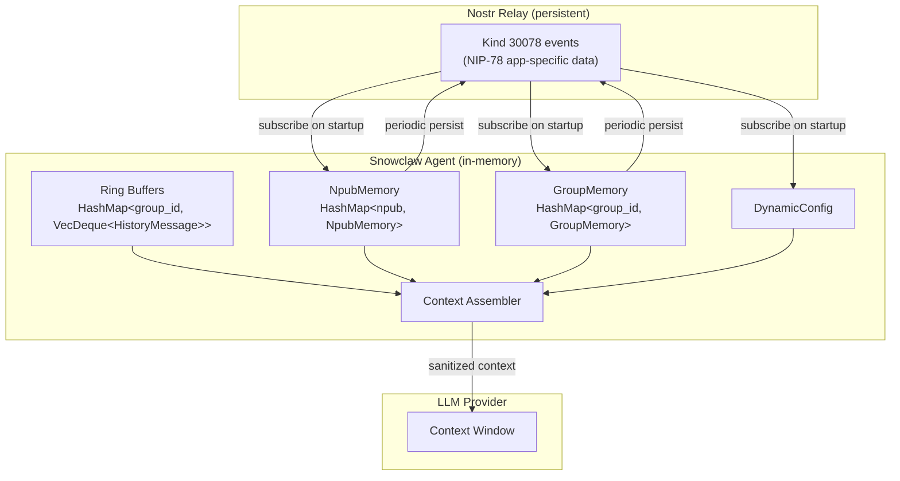
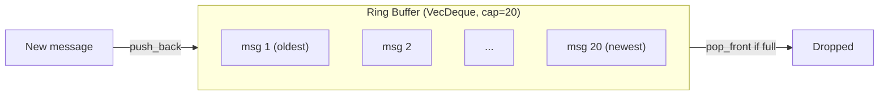
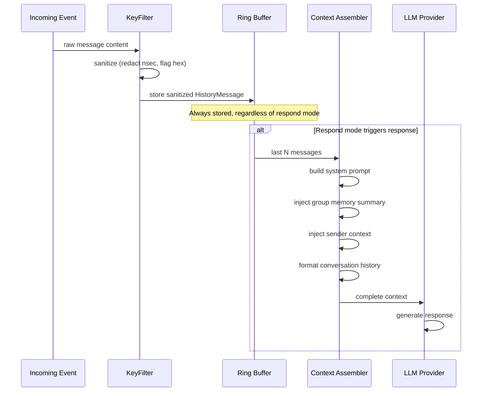
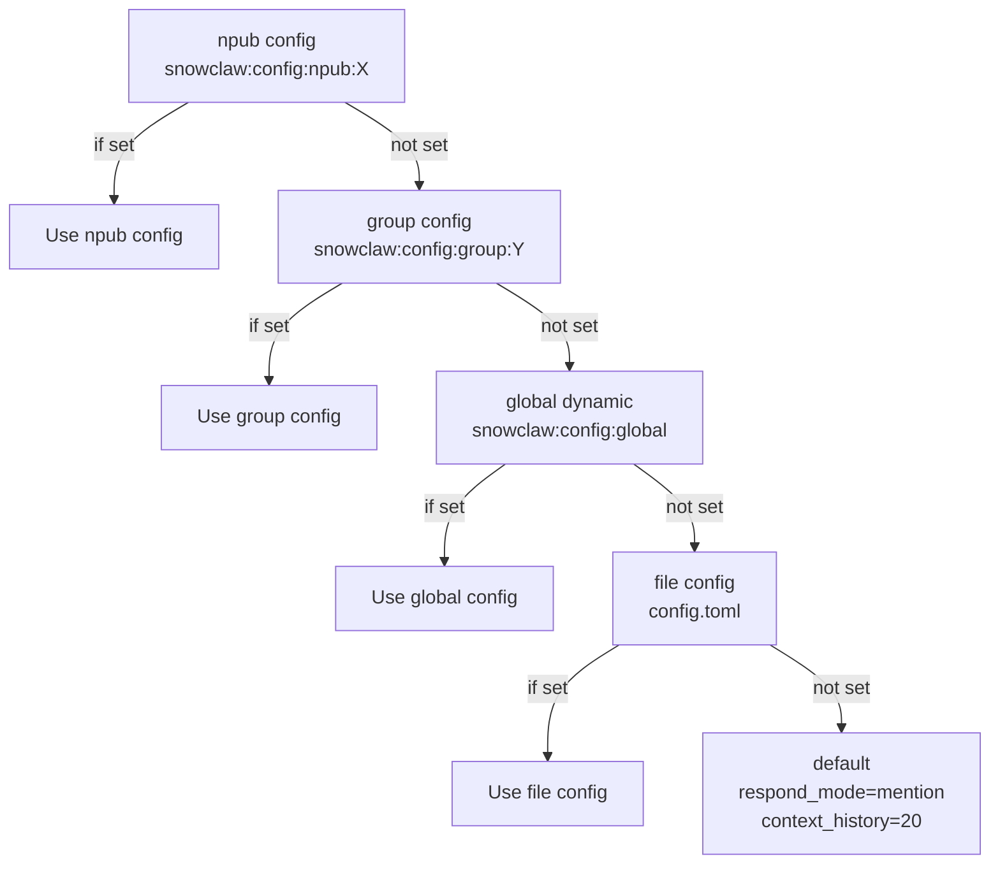
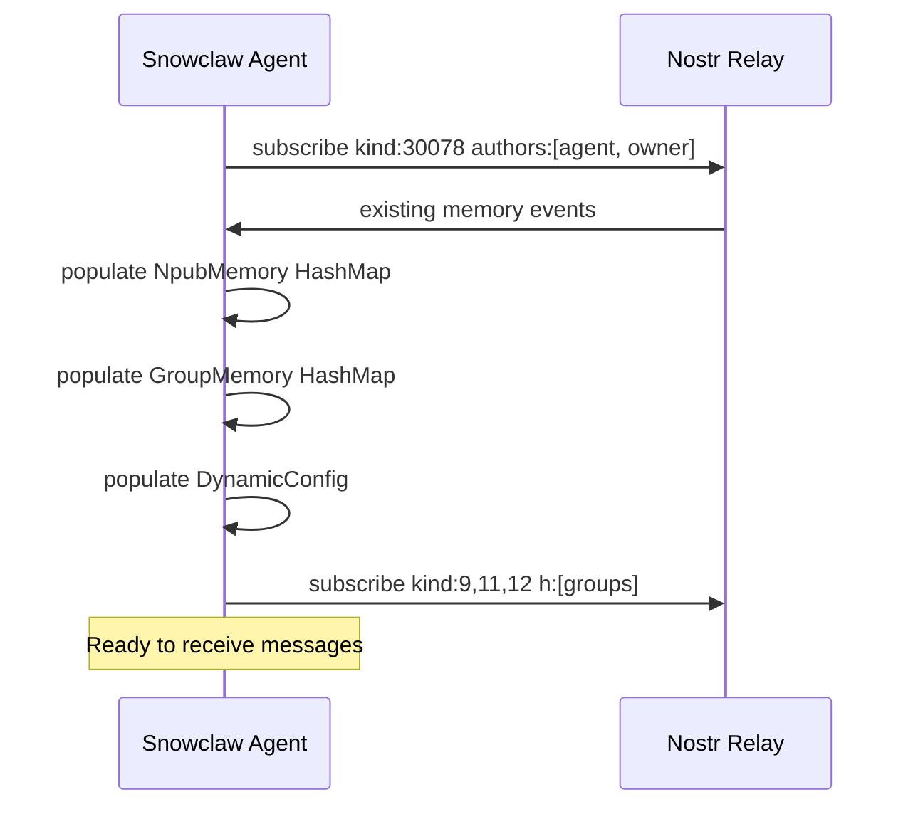

# Memory & Context Management Specification

**Version:** v0.1
**Date:** 2026-02-18
**Status:** Draft

Defines Snowclaw's memory architecture, context assembly pipeline, and dynamic configuration system. Memory is relay-backed (NIP-78 kind 30078) with in-memory caching.

**Related specs:** [nostr-events.md](nostr-events.md) | [security.md](security.md) | [nostr-bridge.md](nostr-bridge.md)

---

## Architecture Overview



---

## 1. Per-Npub Memory

Each user (identified by npub) that interacts with Snowclaw gets an auto-created memory record.

### NpubMemory Struct

```rust
struct NpubMemory {
    /// Display name history (tracks name changes)
    display_names: Vec<(String, u64)>,  // (name, timestamp)
    /// First interaction timestamp
    first_seen: u64,
    /// Free-form notes (agent observations, owner annotations)
    notes: Vec<String>,
    /// User preferences (e.g., language, verbosity)
    preferences: HashMap<String, String>,
    /// Whether this npub is the owner
    is_owner: bool,
}
```

### NIP-78 Persistence

```json
{
  "kind": 30078,
  "content": "{\"display_names\":[[\"k0\",1739800000]],\"first_seen\":1739800000,\"notes\":[\"Project lead\",\"Prefers concise responses\"],\"preferences\":{\"language\":\"en\"},\"is_owner\":true}",
  "tags": [
    ["d", "snowclaw:memory:npub:d29fe7c1af179eac10767f57ac021f52"],
    ["h", "inner-circle"]
  ]
}
```

### Lifecycle

1. **Creation:** Auto-created on first message from a new npub. Populated with display name from profile cache and `first_seen` timestamp.
2. **Updates:** Agent adds notes and preferences as it learns about the user through conversation.
3. **Persistence:** Periodically published to relay as kind 30078. The `d` tag makes it replaceable — only the latest version is kept.
4. **Deletion:** No automatic deletion. Owner can clear via CLI.
5. **Owner annotations:** Owner can add notes via `zeroclaw nostr memory set` or by posting kind 30078 events directly.

### Access Control

- Memory events are authored by the agent (signed with agent's nsec).
- `h` tag scopes visibility to the group's relay members.
- When used across groups, the npub hex prefix in the `d` tag is truncated to 32 chars (first half of pubkey) for brevity while maintaining uniqueness.

---

## 2. Per-Group Memory

Each NIP-29 group gets an auto-created memory record.

### GroupMemory Struct

```rust
struct GroupMemory {
    /// Group purpose / description
    purpose: Option<String>,
    /// Known member display names (resolved from profiles)
    members: Vec<(String, String)>,  // (npub, display_name)
    /// Discussion themes and topics
    themes: Vec<String>,
    /// Key decisions made in the group
    decisions: Vec<(String, u64)>,  // (decision, timestamp)
}
```

### NIP-78 Persistence

```json
{
  "kind": 30078,
  "content": "{\"purpose\":\"Core team coordination and architecture decisions\",\"members\":[[\"npub1abc...\",\"k0\"],[\"npub1def...\",\"Clarity\"]],\"themes\":[\"nostr\",\"agents\",\"task-system\"],\"decisions\":[[\"Use NIP-78 for memory\",1739800000],[\"Zooid as primary relay\",1739850000]]}",
  "tags": [
    ["d", "snowclaw:memory:group:techteam"],
    ["h", "techteam"]
  ]
}
```

### Lifecycle

1. **Creation:** Auto-created when agent first receives a message from a group.
2. **Updates:** Agent updates themes and decisions as conversations progress. Member list updated when new profiles are resolved.
3. **Persistence:** Same as npub memory — periodic kind 30078 publish.
4. **Cross-group isolation:** Each group's memory is separate. Agent does not leak context between groups unless explicitly configured.

---

## 3. Context Ring Buffer

Per-group message history used to build conversation context for the LLM.

### HistoryMessage Struct

```rust
struct HistoryMessage {
    /// Display name of sender
    sender: String,
    /// Sender's npub (bech32)
    npub: String,
    /// Message content (already sanitized)
    content: String,
    /// Event timestamp (unix)
    timestamp: u64,
    /// Nostr event ID (hex)
    event_id: String,
    /// Whether sender is the owner
    is_owner: bool,
}
```

### Behavior

- **Capacity:** Configurable via `context_history` (default: 20 messages per group).
- **Storage:** `VecDeque<HistoryMessage>` — oldest messages dropped when capacity exceeded.
- **Scope:** ALL messages are cached regardless of respond mode. Even in `owner` mode, the agent sees the full conversation history when it does respond.
- **Persistence:** In-memory only. Ring buffer is not persisted to relay. On restart, agent starts with empty history and rebuilds from incoming events.



### Dynamic Configuration

Ring buffer size can be adjusted at runtime via dynamic config events:

```json
{
  "kind": 30078,
  "content": "{\"context_history\": 30}",
  "tags": [
    ["d", "snowclaw:config:group:techteam"],
    ["h", "techteam"]
  ]
}
```

Only accepted from owner pubkey.

---

## 4. LLM Context Assembly

When the agent decides to respond (based on respond mode), it assembles the full LLM context.

### Context Structure

```
┌─────────────────────────────────────────────┐
│ SYSTEM PROMPT                                │
│  - Agent identity (name, role, capabilities) │
│  - Owner npub + display name              │
│  - Current group context (name, purpose)     │
│  - Behavioral instructions                   │
├─────────────────────────────────────────────┤
│ GROUP MEMORY SUMMARY                         │
│  - Group purpose                             │
│  - Key themes                                │
│  - Recent decisions                          │
├─────────────────────────────────────────────┤
│ SENDER CONTEXT                               │
│  - Sender npub + display name                │
│  - Is owner: yes/no                        │
│  - Npub memory notes (if any)                │
│  - Sender preferences                        │
├─────────────────────────────────────────────┤
│ CONVERSATION HISTORY                         │
│  - Last N messages from ring buffer          │
│  - Format: [sender_name]: content            │
│  - Owner messages marked                  │
├─────────────────────────────────────────────┤
│ CURRENT MESSAGE                              │
│  - Sender, content, group                    │
└─────────────────────────────────────────────┘
```

### Assembly Pipeline



### Token Budget Management

The context assembler must fit within the model's context window. Priority order for trimming:

1. **System prompt** — always included (fixed size, not trimmed)
2. **Current message** — always included
3. **Sender context** — always included (small)
4. **Conversation history** — trimmed from oldest first
5. **Group memory summary** — summarized/trimmed if needed
6. **Npub memory notes** — summarized/trimmed if needed

### Message Format in Context

Messages are formatted as compact headers in the ring buffer (matching the Nostr channel's `[nostr:...]` header format):

```
[nostr:group=#techteam from=k0 kind=9 id=abc12345]
I've finished implementing the Nostr channel trait. Tests pass.

[nostr:group=#techteam from=Snowclaw kind=9 id=def67890]
Great work. I can see the implementation in src/channels/nostr.rs. All 12 tests pass.
```

Owner messages include a marker:

```
[nostr:group=#techteam from=k0 kind=9 id=abc12345 owner=true]
Update the respond mode to mention-only for this group.
```

---

## 5. Dynamic Configuration

Runtime configuration via NIP-78 events, published by the owner.

### Config Event Structure

```json
{
  "kind": 30078,
  "pubkey": "<owner-pubkey-hex>",
  "content": "{\"respond_mode\":\"mention\",\"context_history\":30}",
  "tags": [
    ["d", "snowclaw:config:group:techteam"],
    ["h", "techteam"]
  ]
}
```

### Config Scopes

| `d` tag pattern | Scope | Description |
|-----------------|-------|-------------|
| `snowclaw:config:global` | Global | Applies to all groups and DMs |
| `snowclaw:config:group:<id>` | Per-group | Overrides global for specific group |
| `snowclaw:config:npub:<hex>` | Per-user | Overrides group for specific user |

### DynamicConfig Struct

```rust
struct DynamicConfig {
    global: Option<GroupConfig>,
    groups: HashMap<String, GroupConfig>,
    npubs: HashMap<String, GroupConfig>,
}

struct GroupConfig {
    respond_mode: Option<RespondMode>,
    context_history: Option<usize>,
}
```

### Config Resolution Order

When determining effective config for a message from `npub_X` in `group_Y`:



### Supported Dynamic Config Fields

| Field | Type | Default | Description |
|-------|------|---------|-------------|
| `respond_mode` | string | `"mention"` | Response trigger mode |
| `context_history` | int | `20` | Ring buffer size |

### Security

- Dynamic config events are **only accepted from the owner pubkey**.
- Events from other pubkeys with `snowclaw:config:*` d-tags are silently ignored.
- See [security.md](security.md) section 3 for full access control details.

### Live Updates

Snowclaw subscribes to config events on startup and processes them in the event loop. Config changes take effect immediately — no restart required.

---

## 6. Memory Lifecycle

### Startup



### Runtime

- **Memory reads:** From in-memory HashMaps (fast, no relay round-trip).
- **Memory writes:** To in-memory HashMap immediately. Periodically flushed to relay as kind 30078 events (debounced, not on every change).
- **Ring buffer:** Populated from incoming events. Not persisted.
- **Dynamic config:** Applied immediately from event loop.

### Persistence Timing

| Data | Persistence | Timing |
|------|-------------|--------|
| NpubMemory | Relay (kind 30078) | Periodic flush (e.g., every 5 minutes or on significant change) |
| GroupMemory | Relay (kind 30078) | Periodic flush |
| Ring buffer | None (in-memory only) | Lost on restart |
| DynamicConfig | Relay (owner-published) | Already persistent — agent only reads |

### Memory Operations

| Operation | Method | Notes |
|-----------|--------|-------|
| Read | Subscribe `kind:30078` with `#d` filter | On startup |
| Write | Publish kind 30078 with same `d` tag | Replaces previous version |
| List | Subscribe `kind:30078` by author + `d` prefix | For CLI/dashboard |
| Delete | NIP-09 deletion request | Relay may not honor |
| Search | Client-side over fetched events | Relay doesn't index content |

---

## 7. CLI Memory Commands

```bash
# View memory for a user
zeroclaw nostr memory get npub1abc...

# Set a note on a user's memory
zeroclaw nostr memory set npub1abc... --note "Prefers detailed explanations"

# View group memory
zeroclaw nostr memory get group:techteam

# List all memory keys
zeroclaw nostr memory list

# Dynamic config: set respond mode for a group
zeroclaw nostr config set group:techteam respond_mode=mention

# Dynamic config: get current config for a group
zeroclaw nostr config get group:techteam
```

---

## 8. Access Control for Memory

| Memory type | Read access | Write access |
|-------------|-------------|--------------|
| `snowclaw:memory:npub:*` | Group members (via `h` tag) | Agent only |
| `snowclaw:memory:group:*` | Group members (via `h` tag) | Agent only |
| `snowclaw:config:*` | Agent + owner | Owner only |

- Memory events are signed by the agent's nsec. Only the agent can update them.
- Config events are signed by the owner's nsec. Only the owner can update them.
- The `h` tag on memory events scopes visibility to group members (relay-enforced).
- See [security.md](security.md) for the full access control model.

---

## 9. Future: NIP-44 Encrypted Memory

For truly private memory (not visible to group members):

```json
{
  "kind": 30078,
  "content": "<nip44-encrypted-json>",
  "tags": [
    ["d", "snowclaw:memory:npub:d29fe7c1af179eac"],
    ["encrypted", "nip44"]
  ]
}
```

- Content encrypted to agent's own pubkey (self-encryption)
- Decrypted by agent on read
- Not currently implemented — planned for Phase 4
- Use case: storing sensitive user preferences or internal agent state

## Data Sovereignty Principle (v0.2)

**The Nostr relay is the canonical store for all Snowclaw data.** SQLite and in-memory caches are performance optimizations only — not sources of truth.

### Hierarchy
1. **Nostr relay** — authoritative (NIP-78 kind 30078 for memory, kind 9 for conversations, kind 1621 for tasks)
2. **Local cache** (SQLite/in-memory) — fast reads, populated from relay on startup
3. **Config file** — bootstrap defaults, overridden by relay-stored dynamic config

### Implications
- `auto_save = false` for SQLite conversation memory — the ring buffer + relay handles this
- Conversation history lives in the relay's event stream, cached locally in the per-group ring buffer
- Memory (per-npub, per-group) persists to relay as NIP-78 events, cached in `nostr_memory.json`
- If local cache is lost, agent recovers everything from relay on next startup
- No data is exclusive to local storage — everything that matters is on the relay
