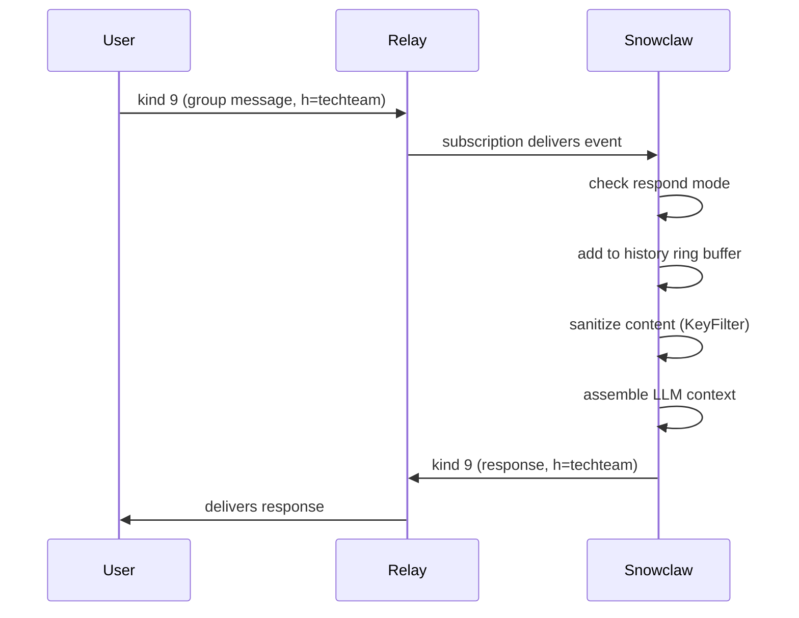
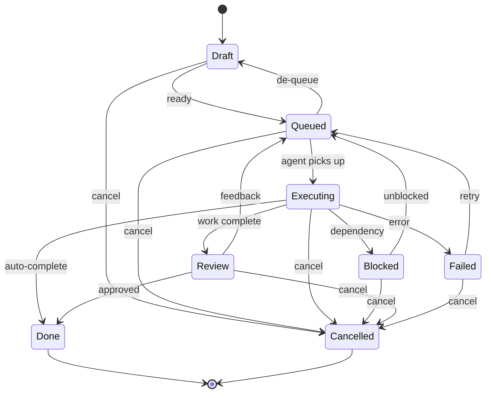

# Nostr Event Specification

**Version:** v0.1
**Date:** 2026-02-18
**Status:** Draft

Defines all Nostr event kinds used by Snowclaw. Each event includes JSON examples, required/optional tags, validation rules, and how Snowclaw creates and consumes it.

**Related specs:** [security.md](security.md) | [memory-context.md](memory-context.md) | [nostr-bridge.md](nostr-bridge.md)

---

## Event Kinds Overview

| Kind | Type | Purpose | NIP | Status |
|------|------|---------|-----|--------|
| 0 | Replaceable | Profile metadata | NIP-01 | Standard |
| 9 | Regular | Group chat message | NIP-29 | Standard |
| 11 | Regular | Group thread root | NIP-29 | Standard |
| 12 | Regular | Group thread reply | NIP-29 | Standard |
| 1059 | Regular | Gift-wrapped DM | NIP-17 | Standard |
| 1060 | Regular | Sealed sender | NIP-17 | Standard |
| 1621 | Addressable | Task definition | NIP-34 ext | Extended |
| 1630 | Regular | Status: Queued/Open | NIP-34 | Standard |
| 1631 | Regular | Status: Done/Resolved | NIP-34 | Standard |
| 1632 | Regular | Status: Cancelled/Closed | NIP-34 | Standard |
| 1633 | Regular | Status: Draft | NIP-34 | Standard |
| 1634 | Regular | Status: Executing | — | New |
| 1635 | Regular | Status: Blocked | — | New |
| 1636 | Regular | Status: Review | — | New |
| 1637 | Regular | Status: Failed | — | New |
| 4129 | Regular | Agent lesson (learned behavior) | NIP-AE | New |
| 4199 | Addressable | Agent definition | NIP-AE | New |
| 4201 | Regular | Agent nudge (behavioral modifier) | NIP-AE | New |
| 9000-9020 | Regular | Group admin events | NIP-29 | Standard |
| 22242 | Ephemeral | Relay AUTH | NIP-42 | Standard |
| 30078 | Addressable | App-specific data (memory) | NIP-78 | Standard |
| 31617 | Addressable | Project definition | NIP-34 ext | Extended |
| 14199 | Replaceable | Owner claims (lists agent pubkeys) | NIP-AE | New |
| 31923 | Addressable | Task run state (live) | — | New |

---

## 1. Identity — Kind 0 (Profile Metadata)

Agent profile published on startup.

### JSON Example

```json
{
  "kind": 0,
  "pubkey": "<agent-pubkey-hex>",
  "created_at": 1739900000,
  "content": "{\"name\":\"Snowclaw\",\"about\":\"Nostr-native AI agent (ZeroClaw runtime)\",\"picture\":\"https://example.com/snowclaw-avatar.png\",\"nip05\":\"snowclaw@atlantislabs.space\"}",
  "tags": [
    ["agent", "snowclaw"],
    ["bot"],
    ["p", "<owner-pubkey-hex>"],
    ["e", "<agent-definition-event-id>"]
  ],
  "id": "<event-id>",
  "sig": "<signature>"
}
```

### Tags

| Tag | Required | Description |
|-----|----------|-------------|
| `agent` | Optional | Identifies this profile as an AI agent. Value is the agent name. |
| `bot` | Recommended | Empty tag indicating this is an automated/bot pubkey (NIP-AE). |
| `p` | Recommended | Owner's pubkey. Claims ownership for bidirectional verification (NIP-AE). Only included if owner is configured. |
| `e` | Optional | References a kind 4199 Agent Definition event for this agent (NIP-AE). |

### Content Fields (JSON)

| Field | Required | Description |
|-------|----------|-------------|
| `name` | Yes | Display name |
| `about` | Yes | Agent description |
| `picture` | No | Avatar URL |
| `nip05` | No | NIP-05 verification identifier |

### Validation Rules

- Content must be valid JSON.
- `name` must be non-empty.
- Published once on startup; updated only when config changes.
- If no owner is configured: no `["p", ...]` tag is included, no bidirectional verification is possible, and config events from kind 30078 have no trusted source to validate against.

### NIP-AE: Bidirectional Verification

When an owner is configured, Snowclaw's kind 0 includes a `["p", "<owner-pubkey>"]` tag claiming ownership. For full verification, the owner must also publish a **kind 14199** event listing the agent's pubkey. Both sides must point to each other:

1. **Agent → Owner:** Agent's kind 0 has `["p", "<owner-pubkey>"]`
2. **Owner → Agent:** Owner's kind 14199 has `["p", "<agent-pubkey>"]`

Clients can verify both events exist to confirm the owner-agent relationship is genuine.

### Snowclaw Behavior

- **Creates:** On daemon start, publishes kind 0 with agent identity from config.
- **Consumes:** Reads kind 0 from other pubkeys to resolve display names. Cached in `CachedProfile` with TTL.

---

## 1b. Agent Definition — Kind 4199 (NIP-AE)

An addressable event that defines an AI agent's identity, capabilities, and behavior. Published by the owner.

### JSON Example

```json
{
  "kind": 4199,
  "pubkey": "<owner-pubkey-hex>",
  "created_at": 1739900000,
  "content": "",
  "tags": [
    ["d", "snowclaw"],
    ["title", "Snowclaw"],
    ["role", "Nostr-native AI agent"],
    ["description", "AI agent running on ZeroClaw runtime, operating in Nostr relay groups"],
    ["instructions", "Respond helpfully in group chats. Follow owner directives."],
    ["use-criteria", "General-purpose AI assistant for Nostr communities"],
    ["ver", "0.1.0"],
    ["image", "https://example.com/snowclaw-avatar.png"],
    ["tool", "web_search", "Search the web"],
    ["tool", "memory", "Persistent memory store"],
    ["e", "<previous-version-event-id>", "", "supersedes"],
    ["p", "<agent-pubkey-hex>"]
  ],
  "id": "<event-id>",
  "sig": "<signature>"
}
```

### Tags

| Tag | Required | Description |
|-----|----------|-------------|
| `d` | Yes | Agent slug (addressable identifier) |
| `title` | Yes | Human-readable agent name |
| `role` | No | Short role description |
| `description` | No | Longer description of the agent |
| `instructions` | No | Default behavioral instructions |
| `use-criteria` | No | When/how to use this agent |
| `ver` | No | Version string |
| `image` | No | Avatar/icon URL |
| `tool` | No | Tool name + description (repeatable) |
| `e` | No | Reference to previous version (marker: `supersedes`) |
| `p` | No | Agent's pubkey |

### Snowclaw Usage

- **Creates:** Not yet — owner publishes manually or via tooling.
- **Consumes:** If referenced in kind 0 `["e", ...]` tag, can be used to display agent metadata.

---

## 1c. Owner Claims — Kind 14199 (NIP-AE)

A replaceable event published by the owner to declare which agent pubkeys they control.

### JSON Example

```json
{
  "kind": 14199,
  "pubkey": "<owner-pubkey-hex>",
  "created_at": 1739900000,
  "content": "",
  "tags": [
    ["p", "<agent-pubkey-hex-1>"],
    ["p", "<agent-pubkey-hex-2>"]
  ],
  "id": "<event-id>",
  "sig": "<signature>"
}
```

### Tags

| Tag | Required | Description |
|-----|----------|-------------|
| `p` | Yes | Agent pubkey (repeatable — one per agent the owner controls) |

### Bidirectional Verification

For a verified owner-agent relationship, **both** must exist:
- Agent's kind 0 contains `["p", "<owner-pubkey>"]`
- Owner's kind 14199 contains `["p", "<agent-pubkey>"]`

If only one side exists, the claim is unverified. Clients SHOULD check both.

### Snowclaw Usage

- **Creates:** Not yet — owner publishes manually.
- **Consumes:** Could verify owner claims in future. Currently trusts configured owner pubkey.

---

## 1d. Agent Nudge — Kind 4201 (NIP-AE)

Behavioral modifiers and tool control directives sent to an agent. Published by the owner or authorized users.

### JSON Example

```json
{
  "kind": 4201,
  "pubkey": "<owner-pubkey-hex>",
  "created_at": 1739900000,
  "content": "Be more concise in responses. Limit to 280 characters when possible.",
  "tags": [
    ["p", "<agent-pubkey-hex>"],
    ["e", "<agent-definition-event-id>"]
  ],
  "id": "<event-id>",
  "sig": "<signature>"
}
```

### Snowclaw Usage

- **Creates/Consumes:** Not yet implemented. Future: owner-sent nudges could adjust agent behavior dynamically.

---

## 1e. Agent Lesson — Kind 4129 (NIP-AE)

Lessons learned by the agent, referencing the agent definition. Can be used to persist behavioral learnings.

### JSON Example

```json
{
  "kind": 4129,
  "pubkey": "<agent-pubkey-hex>",
  "created_at": 1739900000,
  "content": "When users ask about relay configuration, they usually mean NIP-29 group setup, not general relay settings.",
  "tags": [
    ["e", "<agent-definition-event-id>", "", "agent-definition"]
  ],
  "id": "<event-id>",
  "sig": "<signature>"
}
```

### Snowclaw Usage

- **Creates/Consumes:** Not yet implemented. Future: agent could publish learned patterns as kind 4129 events.

---

## 2. Group Messaging — Kind 9, 11, 12 (NIP-29)

Primary communication channel. All group messages flow through the NIP-29 relay (e.g., zooid).

### Kind 9 — Group Chat Message

```json
{
  "kind": 9,
  "pubkey": "<sender-pubkey-hex>",
  "created_at": 1739900100,
  "content": "I've finished implementing the Nostr channel trait. Tests pass.",
  "tags": [
    ["h", "techteam"]
  ],
  "id": "<event-id>",
  "sig": "<signature>"
}
```

### Kind 11 — Group Thread Root

```json
{
  "kind": 11,
  "pubkey": "<sender-pubkey-hex>",
  "created_at": 1739900200,
  "content": "RFC: Should we use NIP-44 encryption for all memory events?",
  "tags": [
    ["h", "techteam"],
    ["subject", "Memory encryption discussion"]
  ],
  "id": "<event-id>",
  "sig": "<signature>"
}
```

### Kind 12 — Group Thread Reply

```json
{
  "kind": 12,
  "pubkey": "<sender-pubkey-hex>",
  "created_at": 1739900300,
  "content": "Group-scoped access via relay is sufficient for most cases.",
  "tags": [
    ["h", "techteam"],
    ["e", "<thread-root-event-id>", "", "root"],
    ["e", "<parent-reply-event-id>", "", "reply"],
    ["p", "<thread-root-author-pubkey>"]
  ],
  "id": "<event-id>",
  "sig": "<signature>"
}
```

### Tags

| Tag | Required | Kind | Description |
|-----|----------|------|-------------|
| `h` | Yes | 9, 11, 12 | NIP-29 group ID |
| `subject` | No | 11 | Thread subject line |
| `e` (root) | Yes | 12 | Thread root event ID |
| `e` (reply) | No | 12 | Parent reply event ID |
| `p` | No | 12 | Pubkey of referenced author |

### Validation Rules

- `h` tag must match a configured group in `config.toml`.
- Relay enforces group membership (only members can post/read).
- Content is plaintext (no encryption for group messages).

### Snowclaw Behavior

- **Creates:** Kind 9 for responses. Agent prepends no special formatting — just the reply text.
- **Consumes:** Subscribes to kinds 9, 11, 12 for configured groups. Messages are stored in the per-group history ring buffer (see [memory-context.md](memory-context.md)). Respond mode determines when the agent replies:
  - `all` — reply to every message
  - `mention` — reply when agent name or npub is mentioned, or when replied to
  - `owner` — reply only to owner's messages
  - `none` — listen only, never auto-reply



---

## 3. Direct Messages — Kind 1059, 1060 (NIP-17)

Private human-to-agent and agent-to-human communication.

### Kind 1059 — Gift-Wrapped DM

The outer envelope. Content is NIP-44 encrypted, containing a kind 1060 sealed event.

```json
{
  "kind": 1059,
  "pubkey": "<ephemeral-pubkey>",
  "created_at": 1739900400,
  "content": "<nip44-encrypted-kind-1060>",
  "tags": [
    ["p", "<recipient-pubkey-hex>"]
  ],
  "id": "<event-id>",
  "sig": "<signature>"
}
```

### Kind 1060 — Sealed Sender (Inner Event)

```json
{
  "kind": 1060,
  "pubkey": "<real-sender-pubkey>",
  "created_at": 1739900400,
  "content": "<nip44-encrypted-plaintext-message>",
  "tags": [
    ["p", "<recipient-pubkey-hex>"]
  ],
  "id": "<event-id>",
  "sig": "<signature>"
}
```

### Tags

| Tag | Required | Description |
|-----|----------|-------------|
| `p` | Yes | Recipient pubkey (hex) |

### Validation Rules

- Outer event (1059) uses an ephemeral key for sender privacy.
- Inner event (1060) is signed by the real sender.
- Content is NIP-44 encrypted at both layers.
- Snowclaw only processes DMs if `listen_dms = true` in config.

### Snowclaw Behavior

- **Creates:** Gift-wrapped DMs via nostr-sdk when replying privately.
- **Consumes:** Decrypts incoming kind 1059 using agent's nsec. Sender identity verified from inner kind 1060 signature. Access control checked against `allowed_pubkeys`.

---

## 4. Authentication — Kind 22242 (NIP-42)

Relay authentication, mandatory for the zooid relay.

```json
{
  "kind": 22242,
  "pubkey": "<agent-pubkey-hex>",
  "created_at": 1739900000,
  "content": "",
  "tags": [
    ["relay", "wss://zooid.atlantislabs.space"],
    ["challenge", "<challenge-string-from-relay>"]
  ],
  "id": "<event-id>",
  "sig": "<signature>"
}
```

### Tags

| Tag | Required | Description |
|-----|----------|-------------|
| `relay` | Yes | Relay URL the auth is for |
| `challenge` | Yes | Challenge string from relay's AUTH message |

### Validation Rules

- Must be signed by the connecting client's key.
- `relay` tag must match the connected relay URL.
- `challenge` must match the relay-provided challenge.

### Snowclaw Behavior

- **Creates:** Automatically on relay connection via nostr-sdk. No user intervention needed.
- **Consumes:** N/A (relay consumes this).

---

## 5. Task Definition — Kind 1621 (NIP-34 Extended)

Addressable/replaceable task event. The `d` tag makes it updatable — publishing a new kind 1621 with the same `d` tag replaces the previous version.

### JSON Example

```json
{
  "kind": 1621,
  "pubkey": "<creator-pubkey-hex>",
  "created_at": 1739900500,
  "content": "## Description\n\nImplement the Nostr channel trait for ZeroClaw.\n\n## Acceptance Criteria\n- [ ] NIP-42 AUTH works\n- [ ] NIP-29 group subscribe/publish\n- [ ] Reconnect with backoff",
  "tags": [
    ["d", "snow-task-a1b2c3"],
    ["subject", "Implement Nostr channel trait"],
    ["project", "snowclaw"],
    ["t", "feature"],
    ["t", "nostr"],
    ["priority", "high"],
    ["due", "1740000000"],
    ["p", "<assignee-pubkey-hex>", "", "assignee"],
    ["p", "<creator-pubkey-hex>", "", "creator"],
    ["e", "<parent-task-event-id>", "", "parent"],
    ["e", "<depends-on-task-event-id>", "", "depends-on"],
    ["numbering", "1-2"],
    ["alt", "Task: Implement Nostr channel trait"]
  ],
  "id": "<event-id>",
  "sig": "<signature>"
}
```

### Tags

| Tag | Required | Description |
|-----|----------|-------------|
| `d` | Yes | Unique task identifier (makes event addressable/replaceable) |
| `subject` | Yes | Task title (short, human-readable) |
| `project` | No | Project reference (e.g., "snowclaw", or a project event ID) |
| `t` | No | Labels/tags (repeatable) |
| `priority` | No | Priority level: `highest`, `high`, `medium`, `low`, `lowest` |
| `due` | No | Due date as unix timestamp |
| `p` (assignee) | No | Assignee pubkey with `assignee` marker in position 3 |
| `p` (creator) | Yes | Creator pubkey with `creator` marker in position 3 |
| `e` (parent) | No | Parent task event ID with `parent` marker (subtask relationship) |
| `e` (depends-on) | No | Dependency task event ID with `depends-on` marker (repeatable) |
| `numbering` | No | Hierarchical task number (e.g., "2-3-1" for task 2, subtask 3, sub-subtask 1) |
| `alt` | Yes | NIP-31 alt text for clients that don't understand kind 1621 |

### Content Format

Markdown body with optional sections:
- `## Description` — task details
- `## Acceptance Criteria` — checklist of completion conditions

### Validation Rules

- `d` tag must be present and unique per author.
- `subject` tag must be non-empty.
- `priority` must be one of: `highest`, `high`, `medium`, `low`, `lowest`.
- `due` must be a valid unix timestamp if present.
- `p` tags with markers must contain valid hex pubkeys.
- `e` tags with markers must contain valid hex event IDs.

### Snowclaw Behavior

- **Creates:** Via `NostrTaskTool` or CLI (`zeroclaw task create`). Generates a unique `d` tag ID.
- **Consumes:** Subscribes to kind 1621 with filters for assigned tasks and project membership. Parsed via `TaskEvent::from_event()`.

---

## 6. Task Status Events — Kind 1630-1637

Regular (non-replaceable) events that form an immutable audit trail of status transitions. Each status change creates a new event referencing the task.

### Kind Mapping

| Kind | Status | NIP-34 | Description |
|------|--------|--------|-------------|
| 1630 | Queued | Open | Ready for agent pickup |
| 1631 | Done | Resolved | Completed and accepted |
| 1632 | Cancelled | Closed | No longer needed |
| 1633 | Draft | Draft | Incomplete, being specified |
| 1634 | Executing | — (new) | Agent actively working |
| 1635 | Blocked | — (new) | Waiting on dependency/human |
| 1636 | Review | — (new) | Awaiting human review |
| 1637 | Failed | — (new) | Execution error |

### JSON Example (Kind 1634 — Executing)

```json
{
  "kind": 1634,
  "pubkey": "<agent-pubkey-hex>",
  "created_at": 1739900600,
  "content": "Picked up task, starting implementation of Nostr channel trait",
  "tags": [
    ["e", "<task-event-id>", "", "root"],
    ["p", "<task-creator-pubkey>"],
    ["p", "<agent-pubkey>"],
    ["alt", "Status: Executing — Implement Nostr channel trait"]
  ],
  "id": "<event-id>",
  "sig": "<signature>"
}
```

### JSON Example (Kind 1636 — Review)

```json
{
  "kind": 1636,
  "pubkey": "<agent-pubkey-hex>",
  "created_at": 1739901200,
  "content": "## Summary\nImplemented NIP-42 AUTH and NIP-29 group messaging.\n\n## Files Changed\n- src/channels/nostr.rs (new)\n- src/channels/mod.rs (updated)\n\n## Test Results\n- 12 tests passed, 0 failed\n\n## Recommendation\nReady for review. NIP-17 DMs not yet implemented (separate task).",
  "tags": [
    ["e", "<task-event-id>", "", "root"],
    ["p", "<task-creator-pubkey>"],
    ["alt", "Status: Review — Implement Nostr channel trait"]
  ],
  "id": "<event-id>",
  "sig": "<signature>"
}
```

### Tags

| Tag | Required | Description |
|-----|----------|-------------|
| `e` (root) | Yes | Task event ID with `root` marker |
| `p` | No | Referenced pubkeys (task creator, agent) |
| `alt` | Yes | NIP-31 alt text |

### Content Format

- Simple status changes: plain text comment.
- Review (kind 1636): markdown with summary, files changed, test results, recommendation.

### Validation Rules

- `e` tag with `root` marker must reference a valid kind 1621 event.
- Kind must be in the 1630-1637 range.
- Transition must be valid per the state machine (see below).

### State Machine



### Review Workflow Commands

When the agent sets status to Review (kind 1636), humans respond with NIP-22 comments:

| Command | Effect |
|---------|--------|
| `APPROVE` | Agent transitions to Done (1631) |
| `CONTINUE: <feedback>` | Agent transitions to Queued (1630), incorporates feedback |
| `SPAWN: <description>` | Agent creates a follow-up task (kind 1621) |
| `DISCARD` | Agent transitions to Cancelled (1632) |
| `MERGE` | Agent merges branch, transitions to Done (1631) |
| `COMMENT: <text>` | Records note on the task (no state change) |

---

## 7. Task Run State — Kind 31923 (Live Progress)

Addressable/replaceable event updated every few seconds during task execution. The relay keeps only the latest version per `d` tag, giving clients near-real-time progress.

### JSON Example

```json
{
  "kind": 31923,
  "pubkey": "<agent-pubkey-hex>",
  "created_at": 1739900720,
  "content": "Implementing Nostr channel trait — compiling crate...",
  "tags": [
    ["d", "<task-event-id>"],
    ["status", "executing"],
    ["progress", "0.47"],
    ["elapsed", "720"],
    ["estimated", "1800"],
    ["context_used", "42000"],
    ["context_max", "200000"],
    ["tokens_in", "15230"],
    ["tokens_out", "8420"],
    ["model", "claude-sonnet-4-20250514"],
    ["step", "3/7"],
    ["step_name", "Compile and test"],
    ["error_count", "0"],
    ["files_changed", "4"]
  ],
  "id": "<event-id>",
  "sig": "<signature>"
}
```

### Tags

| Tag | Required | Type | Description |
|-----|----------|------|-------------|
| `d` | Yes | string | Task event ID (links to kind 1621 `d` tag) |
| `status` | Yes | enum | Current state: `draft`, `queued`, `executing`, `blocked`, `review`, `done`, `failed`, `cancelled` |
| `progress` | No | float 0.0-1.0 | Estimated completion fraction |
| `elapsed` | No | int (seconds) | Wall time since execution started |
| `estimated` | No | int (seconds) | Estimated total time |
| `context_used` | No | int (tokens) | Context window usage |
| `context_max` | No | int (tokens) | Context window limit |
| `tokens_in` | No | int | Input tokens consumed |
| `tokens_out` | No | int | Output tokens generated |
| `model` | No | string | LLM model identifier |
| `step` | No | string | Current step (e.g., "3/7") |
| `step_name` | No | string | Human-readable step description |
| `error_count` | No | int | Errors encountered during execution |
| `files_changed` | No | int | Number of files modified |

### Validation Rules

- `d` tag must reference a valid task.
- `status` must be a valid state string.
- `progress` must be between 0.0 and 1.0 if present.
- Numeric tags must parse as valid integers/floats.

### Snowclaw Behavior

- **Creates:** Published periodically (every few seconds) while a task is in `Executing` state. Updated by the agent loop.
- **Consumes:** Dashboard clients subscribe to `kind:31923` with `#d` filter to display live progress.

---

## 8. Memory — Kind 30078 (NIP-78 App-Specific Data)

Addressable/replaceable key-value store. See [memory-context.md](memory-context.md) for full memory architecture.

### JSON Example — Per-User Memory

```json
{
  "kind": 30078,
  "pubkey": "<agent-pubkey-hex>",
  "created_at": 1739901000,
  "content": "{\"display_name\":\"k0\",\"first_seen\":1739800000,\"notes\":[\"Project lead\",\"Prefers concise responses\"],\"languages\":[\"en\",\"fi\"]}",
  "tags": [
    ["d", "snowclaw:memory:npub:d29fe7c1af179eac10767f57ac021f52"],
    ["h", "inner-circle"]
  ],
  "id": "<event-id>",
  "sig": "<signature>"
}
```

### JSON Example — Per-Group Memory

```json
{
  "kind": 30078,
  "pubkey": "<agent-pubkey-hex>",
  "created_at": 1739901100,
  "content": "{\"purpose\":\"Core team coordination\",\"themes\":[\"nostr\",\"agents\",\"infrastructure\"],\"decisions\":[\"Use NIP-78 for memory\",\"Zooid as primary relay\"]}",
  "tags": [
    ["d", "snowclaw:memory:group:techteam"],
    ["h", "techteam"]
  ],
  "id": "<event-id>",
  "sig": "<signature>"
}
```

### JSON Example — Dynamic Config

```json
{
  "kind": 30078,
  "pubkey": "<owner-pubkey-hex>",
  "created_at": 1739901200,
  "content": "{\"respond_mode\":\"mention\",\"context_history\":30}",
  "tags": [
    ["d", "snowclaw:config:group:techteam"],
    ["h", "techteam"]
  ],
  "id": "<event-id>",
  "sig": "<signature>"
}
```

### `d` Tag Namespace Schema

| Pattern | Scope | Description |
|---------|-------|-------------|
| `snowclaw:memory:npub:<hex>` | Per-user | Memory about a specific user |
| `snowclaw:memory:group:<group_id>` | Per-group | Memory about a specific group |
| `snowclaw:config:group:<group_id>` | Per-group | Dynamic group configuration |
| `snowclaw:config:npub:<hex>` | Per-user | Dynamic per-user configuration |
| `snowclaw:config:global` | Global | Global dynamic configuration |

### Tags

| Tag | Required | Description |
|-----|----------|-------------|
| `d` | Yes | Namespaced key (see schema above) |
| `h` | No | NIP-29 group ID for group-scoped access control |

### Validation Rules

- `d` tag must follow the `snowclaw:` namespace schema.
- Content must be valid JSON.
- Config events (`snowclaw:config:*`) must originate from owner pubkey to be applied.
- `h` tag scopes visibility to group members (relay-enforced).

### Snowclaw Behavior

- **Creates:** Periodically persists in-memory state to relay. Memory events use agent's own pubkey. Config events come from owner.
- **Consumes:** Subscribed on startup. Loaded into `DynamicConfig` and memory maps. Config priority: dynamic event > file config > defaults.

---

## 9. Project Definition — Kind 31617 (NIP-34 Extended)

Addressable/replaceable project metadata event.

### JSON Example

```json
{
  "kind": 31617,
  "pubkey": "<maintainer-pubkey-hex>",
  "created_at": 1739800000,
  "content": "Nostr-native AI agent runtime built on ZeroClaw",
  "tags": [
    ["d", "snowclaw"],
    ["name", "Snowclaw"],
    ["description", "Nostr-native AI agent runtime"],
    ["maintainers", "<k0-pubkey-hex>"],
    ["relays", "wss://zooid.atlantislabs.space"],
    ["clone", "https://github.com/example/snowclaw.git"],
    ["t", "rust"],
    ["t", "nostr"],
    ["t", "ai-agent"]
  ],
  "id": "<event-id>",
  "sig": "<signature>"
}
```

### Tags

| Tag | Required | Description |
|-----|----------|-------------|
| `d` | Yes | Project slug (e.g., "snowclaw") |
| `name` | Yes | Human-readable project name |
| `description` | No | Short project description |
| `maintainers` | No | Maintainer pubkeys (repeatable values) |
| `relays` | No | Preferred relay URLs |
| `clone` | No | Git clone URL |
| `t` | No | Topic tags |

---

## 10. Group Admin Events — Kind 9000-9020 (NIP-29)

Relay-mediated group administration. These are consumed by the relay, not directly by Snowclaw.

### Kind 9000 — Put User

```json
{
  "kind": 9000,
  "content": "",
  "tags": [
    ["h", "techteam"],
    ["p", "<new-member-pubkey-hex>"]
  ]
}
```

### Kind 9001 — Remove User

```json
{
  "kind": 9001,
  "content": "",
  "tags": [
    ["h", "techteam"],
    ["p", "<member-pubkey-hex>"]
  ]
}
```

### Snowclaw Behavior

- **Creates:** Not currently. Group admin is human-managed.
- **Consumes:** Not directly. Relay enforces membership; Snowclaw relies on relay access control.

---

## 11. Sub-Agent Identification

When Snowclaw operates with sub-agents, each sub-agent has its own persistent npub but tags events to indicate its parent agent relationship.

### Agent Tag Convention

```json
{
  "kind": 9,
  "tags": [
    ["h", "techteam"],
    ["agent", "researcher"],
    ["p", "<parent-agent-pubkey>", "", "parent"]
  ],
  "content": "Completed research on NIP-44 encryption performance..."
}
```

| Tag | Description |
|-----|-------------|
| `agent` | Sub-agent role name |
| `p` (parent) | Parent agent's pubkey with `parent` marker |

### Validation Rules

- `agent` tag value must be a non-empty string.
- Parent pubkey must be a valid hex pubkey.
- Sub-agent must have its own signing key (not delegated from parent).

---

## Relay Subscription Filters

Snowclaw subscribes to events using these filter patterns:

### On Startup

```json
[
  {"kinds": [9, 11, 12], "h": ["inner-circle", "techteam"]},
  {"kinds": [1059], "#p": ["<agent-pubkey-hex>"]},
  {"kinds": [30078], "authors": ["<agent-pubkey-hex>", "<owner-pubkey-hex>"]},
  {"kinds": [1621, 1630, 1631, 1632, 1633, 1634, 1635, 1636, 1637]},
  {"kinds": [31923]}
]
```

### Filter Descriptions

| Filter | Purpose |
|--------|---------|
| kinds 9, 11, 12 + h tag | Group messages for subscribed groups |
| kind 1059 + p tag | Gift-wrapped DMs addressed to agent |
| kind 30078 + authors | Memory and config events from agent and owner |
| kinds 1621, 1630-1637 | Task definitions and status changes |
| kind 31923 | Live run state from other agents |

---

## NIP Compatibility Reference

| NIP | Usage | Notes |
|-----|-------|-------|
| NIP-01 | Event signing, basic protocol | Foundation |
| NIP-09 | Event deletion | For memory cleanup (relay may not honor) |
| NIP-17 | Gift-wrapped DMs | Kind 1059/1060 |
| NIP-22 | Comments/threads | Review workflow responses |
| NIP-29 | Relay-based groups | Primary communication |
| NIP-31 | Alt tag | Fallback text for unknown kinds |
| NIP-32 | Labels | AI agent identification |
| NIP-34 | Issues/status | Base for task system (kinds 1621, 1630-1633) |
| NIP-42 | Relay AUTH | Mandatory for zooid |
| NIP-44 | Encryption | Optional for private memory, required for DMs |
| NIP-78 | App-specific data | Memory KV store |
| NIP-AC | Agent coordination | Referenced — heartbeat (30333), reviews (31117), escrow (21117), workflows (5117), swarms (5118) |
| NIP-AE | Agent attribution & verification | Kinds 4199, 14199, 4201, 4129; bidirectional owner verification |
