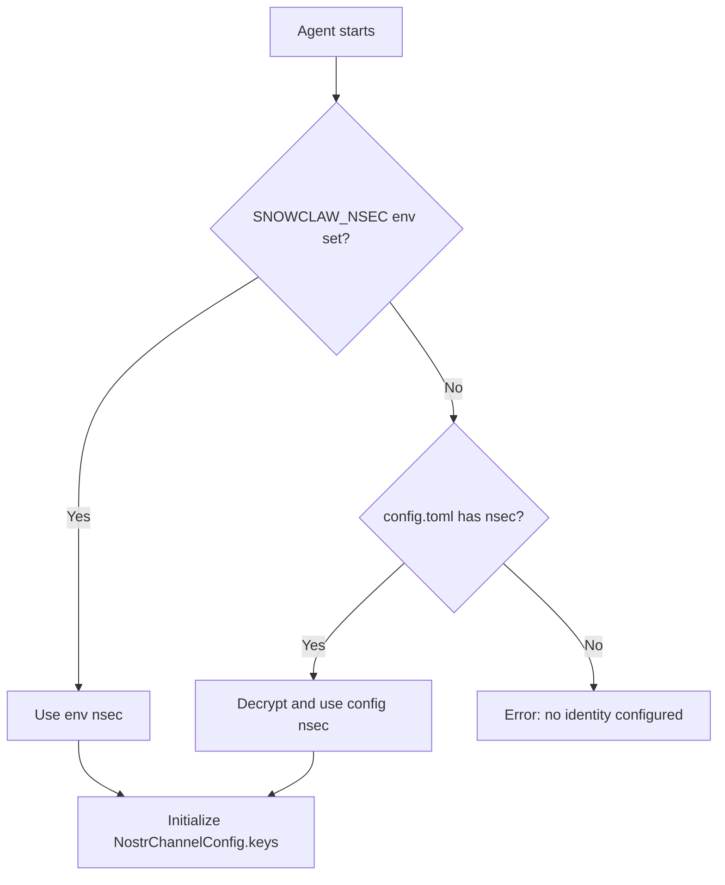
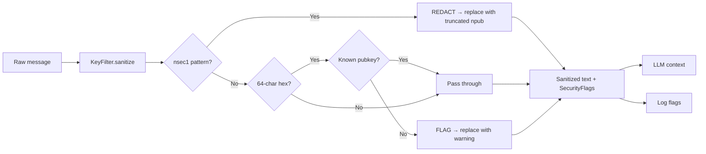
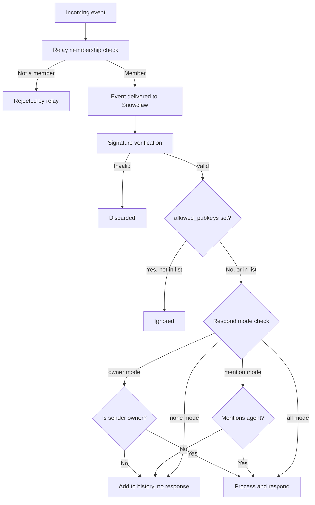

# Security Specification

**Version:** v0.1
**Date:** 2026-02-18
**Status:** Draft

Defines Snowclaw's security model: key management, LLM context sanitization, access control, message integrity, and threat model.

**Related specs:** [nostr-events.md](nostr-events.md) | [memory-context.md](memory-context.md) | [nostr-bridge.md](nostr-bridge.md)

---

## 1. Key Management

### Agent Identity

Every Snowclaw agent has a persistent Nostr keypair (nsec/npub). This keypair is the agent's identity — it signs all events and verifies all incoming messages.

```
Agent: Snowclaw
  npub: npub1jn7stcra3kr60epl05k66hv5v6f4s9qu46n7n98ajp86ttl0997qw4qak0
  nsec: stored in ~/.snowclaw/config.toml (encrypted at rest)
```

### Key Storage

Keys are stored in `config.toml` under the `[nostr]` section:

```toml
[nostr]
nsec = "nsec1..."
```

**Storage security layers:**

| Layer | Mechanism | Implementation |
|-------|-----------|----------------|
| At rest | `SecretStore` encryption | `src/security/secrets.rs` — encrypt/decrypt with machine-local key |
| In memory | Rust ownership | Key held in `NostrChannelConfig.keys`, not cloned unnecessarily |
| Env fallback | `SNOWCLAW_NSEC` | Environment variable, checked before config file |
| File permissions | Unix perms | Config file should be `0600` (owner-only read/write) |

### Key Resolution Order



### Owner Pubkey

The **owner** is an elevated control identity — typically the human operator's npub. The owner has special privileges:

- Can trigger responses in `owner` respond mode
- Can publish dynamic config events (kind 30078 with `snowclaw:config:*`)
- Can view/edit agent memory via CLI
- Receives security flag notifications (optional)

```toml
[nostr]
owner = "npub1..."  # or hex pubkey
```

### Key Generation and Import

CLI commands for key management:

```bash
# Generate new keypair
zeroclaw nostr keygen
# Output: Generated new keypair
#   npub: npub1...
#   nsec: nsec1... (saved to config)

# Show current identity
zeroclaw nostr whoami
# Output: npub1jn7stcra3kr60epl05k66hv5v6f4s9qu46n7n98ajp86ttl0997qw4qak0

# Import existing key
zeroclaw nostr import
# Prompts for nsec, validates, saves to config
```

### Key Rotation Procedure

1. Generate new keypair: `zeroclaw nostr keygen --rotate`
2. Publish new kind 0 profile with new pubkey
3. Post notification to subscribed groups: "Agent identity rotated. New npub: ..."
4. Update NIP-29 group membership via relay admin
5. Old key remains valid for signature verification of historical events
6. Update owner's known-agent list

**Constraints:**
- Key rotation creates a new identity — there is no "key migration" in Nostr
- Historical events signed by old key remain verifiable
- Relay membership must be re-established with new pubkey

---

## 2. LLM Context Sanitization

### Design Principle

**No secrets ever reach the LLM context. Period.**

The `KeyFilter` (`src/security/key_filter.rs`) runs on ALL text before it enters the LLM provider's context window. This is not optional and cannot be disabled.

### Sanitization Pipeline



### Detection Rules

#### Rule 1: nsec Detection (Always Redact)

- **Pattern:** `nsec1[qpzry9x8gf2tvdw0s3jn54khce6mua7l]{58}`
- **Action:** Replace with `[REDACTED nsec → npub1<first-16-chars>...]`
- **Severity:** WARN
- **Rationale:** An nsec is unambiguously a Nostr secret key. Always redact.

**Example:**
```
Input:  "Here is my key: nsec1abc...xyz don't share it"
Output: "Here is my key: [REDACTED nsec → npub1jn7stcra3kr60ep...] don't share it"
```

#### Rule 2: Unknown 64-char Hex (Flag)

- **Pattern:** `\b[0-9a-fA-F]{64}\b`
- **Exclusion:** Skip if hex matches a known pubkey in the allowlist
- **Action:** Replace with `[FLAGGED: unknown 64-char hex <first-16-chars>…]`
- **Severity:** INFO
- **Rationale:** Could be a secret key in hex format. Not all 64-char hex strings are secrets (event IDs, pubkeys), so flag rather than blindly redact.

**Example:**
```
Input:  "Key: aabbccdd11223344556677889900aabbccdd11223344556677889900aabbccdd"
Output: "Key: [FLAGGED: unknown 64-char hex aabbccdd11223344…]"
```

#### Known Pubkey Allowlist

The `KeyFilter` maintains a `HashSet<String>` of known-safe hex pubkeys, populated from:
- Agent's own pubkey
- Owner pubkey
- `allowed_pubkeys` from config
- Profile cache entries (resolved display names)

Known pubkeys in hex form pass through without flagging.

### SecurityFlag Reporting

When the filter detects secrets:

1. **Log:** Warning-level log entry (never includes the actual key)
2. **Metrics:** Atomic counters (`nsec_redacted`, `hex_flagged`) for observability
3. **Owner DM:** Optional — send a NIP-17 DM to owner pubkey on detection (configurable, not yet implemented)

### Fast Path

When text contains no `nsec1` substring and no 64-char hex pattern, the sanitizer short-circuits with zero allocations beyond the input string copy. This is the common case for normal messages.

---

## 3. Access Control

### Access Control Layers



### Respond Modes

| Mode | Trigger | Use Case |
|------|---------|----------|
| `all` | Any message in group | Small groups, active agent |
| `mention` | Agent name/npub mentioned, or reply to agent | Default — agent speaks when spoken to |
| `owner` | Only owner's messages | Restrictive — single-operator control |
| `none` | Never auto-respond | Listen-only, data collection |

### Configuration Hierarchy

Respond mode and access control can be set at multiple levels. Higher-priority settings override lower:

```
Dynamic event (kind 30078) > Config file > Default
```

**Per-scope priority:**
1. Per-npub dynamic config (`snowclaw:config:npub:<hex>`)
2. Per-group dynamic config (`snowclaw:config:group:<id>`)
3. Global dynamic config (`snowclaw:config:global`)
4. Per-group config file setting (`group_respond_mode`)
5. Default config file setting (`respond_mode`)
6. Hardcoded default (`mention`)

### allowed_pubkeys Whitelist

```toml
[nostr]
allowed_pubkeys = [
  "npub1abc...",
  "npub1def..."
]
```

- **Empty list** = allow all group members (relay enforces membership)
- **Non-empty list** = only these pubkeys trigger responses
- Applied after relay membership check (defense in depth)

### Dynamic Config Security

Dynamic config events (kind 30078 with `snowclaw:config:*` d-tags) are only accepted from the **owner pubkey**. Events from any other pubkey are ignored.

```rust
// Pseudocode: config event validation
if event.kind == 30078 && event.d_tag.starts_with("snowclaw:config:") {
    if event.pubkey != owner_pubkey {
        warn!("Ignoring config event from non-owner");
        return;
    }
    apply_config(event);
}
```

---

## 4. Message Integrity

### Nostr Signature Model

Every Nostr event is signed with the author's private key (Schnorr signature over secp256k1). Verification is handled by the relay and nostr-sdk — Snowclaw never processes unverified events.

| Property | Guarantee |
|----------|-----------|
| **Authenticity** | Event pubkey = signer's public key (cryptographic proof) |
| **Integrity** | Content and tags cannot be modified without invalidating signature |
| **Non-repudiation** | Author cannot deny publishing the event |

### Display Name vs. npub

- **Display names are cosmetic.** They come from kind 0 profile events and can be changed at any time.
- **npubs are proof.** They are derived from the signing key and are cryptographically bound to the event.
- Snowclaw uses npubs for all access control decisions. Display names are for UX only.

### Event ID Verification

The event ID is a SHA-256 hash of the serialized event content:
```
id = sha256([0, pubkey, created_at, kind, tags, content])
```

This means the ID is bound to all event fields. Any modification changes the ID and invalidates the signature.

---

## 5. Threat Model

### T1: Prompt Injection via Group Messages

**Threat:** Malicious user posts crafted messages in a NIP-29 group to manipulate the agent's LLM into performing unintended actions.

**Mitigations:**
- Security policy (`src/security/policy.rs`) defines autonomy levels limiting what the agent can do
- Tool execution surface has parameter validation and sandboxing
- Context sanitization removes secrets before LLM processing
- Owner mode limits who can trigger agent responses
- System prompt instructs the LLM to distinguish user messages from instructions

**Residual risk:** Medium. Prompt injection is an unsolved problem for LLMs. Defense is layered, not absolute.

### T2: Key Exfiltration via LLM

**Threat:** Attacker crafts messages that trick the LLM into outputting the agent's nsec or other secrets.

**Mitigations:**
- `KeyFilter` sanitizes ALL text entering LLM context — nsec never reaches the model
- nsec is not included in system prompts
- LLM has no tool to read the config file's secret fields
- Even if LLM outputs an nsec-like string, it would be a hallucination (not the real key)

**Residual risk:** Low. The key literally cannot enter the LLM's context window.

### T3: Impersonation

**Threat:** Attacker sends messages appearing to be from owner or trusted user.

**Mitigations:**
- All events are Schnorr-signed — impersonation requires the private key
- Access control uses pubkeys (cryptographic), not display names (cosmetic)
- Relay verifies signatures before delivery

**Residual risk:** Very low. Requires compromising the target's private key.

### T4: Relay Compromise

**Threat:** Malicious or compromised relay delivers forged events, withholds events, or logs metadata.

**Mitigations:**
- Event signatures verified client-side by nostr-sdk (relay cannot forge events)
- Multiple relay support planned (relay cannot completely censor)
- NIP-17 DMs use ephemeral keys and encryption (relay cannot read DM content or reliably identify sender)

**Residual risk:** Medium for availability (relay can drop events), low for integrity (signatures prevent forgery).

### T5: Memory Poisoning

**Threat:** Attacker publishes malicious kind 30078 events to corrupt agent memory.

**Mitigations:**
- Memory events are only consumed from the agent's own pubkey
- Config events are only consumed from owner pubkey
- `h` tag + relay membership restricts who can write to group-scoped memory

**Residual risk:** Low. Memory write requires agent's own private key.

### T6: Denial of Service via Message Flood

**Threat:** Attacker floods group with messages to exhaust agent's context window or API budget.

**Mitigations:**
- Ring buffer limits context history (default 20 messages)
- Respond mode `mention` or `owner` limits response triggers
- Rate limiting at relay level (relay-specific)
- Cost controls in config (`cost.max_daily`, `cost.max_per_message`)

**Residual risk:** Medium. Relay-level rate limiting varies. Agent's API budget is the primary constraint.

### T7: Sub-Agent Escalation

**Threat:** Sub-agent attempts to perform actions beyond its delegated scope.

**Mitigations:**
- Sub-agents have their own keypairs (not delegated — they can't sign as parent)
- Tool access is configured per-agent in config
- Security policy autonomy levels limit tool capabilities
- Sub-agent events are tagged with `agent` and `parent` for auditability

**Residual risk:** Low. Each agent is independently constrained.

---

## 6. Security Configuration Reference

```toml
[nostr]
# Agent identity (encrypted at rest by SecretStore)
nsec = "nsec1..."

# Owner pubkey — elevated privileges
owner = "npub1..."

# Access control whitelist (empty = allow all group members)
allowed_pubkeys = []

# Respond mode: all | mention | owner | none
respond_mode = "mention"

# DM listening
listen_dms = true

[autonomy]
# Autonomy level: supervised | semi_autonomous | autonomous
level = "supervised"

[cost]
# API budget limits
max_daily = 10.0
max_per_message = 0.50
```

---

## 7. Security Checklist for Contributors

When modifying security-adjacent code (`src/security/`, `src/gateway/`, `src/tools/`, `src/runtime/`):

- [ ] No secrets logged at any log level
- [ ] No secrets in error messages returned to users
- [ ] KeyFilter runs before any new LLM context path
- [ ] Access control decisions use pubkeys, not display names
- [ ] Dynamic config events validated against owner pubkey
- [ ] New tool inputs sanitized and validated
- [ ] Autonomy level checked before tool execution
- [ ] Rollback strategy documented in PR
